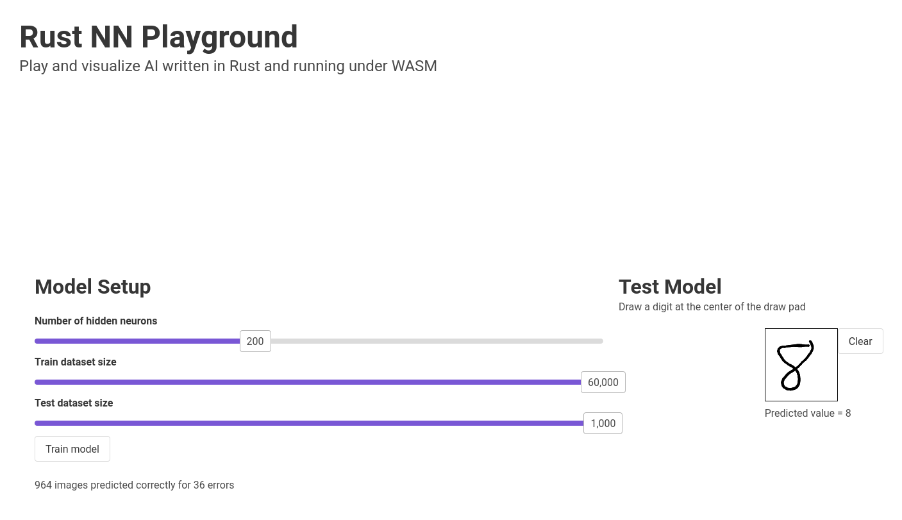

# Rust NN
I share through this repository my personal Proof Of Concept and implementation of self made AI.

Educational only.

[TOC]


## Simple Feed-forward 3 layers Perceptron

With prior training, you can use this NN to predict and classify input data.

### Architecture description

This neural network is composed of 3 layers of perceptrons. The *input*, *hidden* and output layers.

This is one of the simplest setup for a neural network, we can refer it as the [*vanilla* NN](https://en.wikipedia.org/wiki/Multilayer_perceptron). Each layer of perceptron has weighted activations.


[Simple Neural Network]: https://playandlearntocode.com/static/siteapp/assets/articles/mlp-1/mlp-1-nodes.png	"Simple Neural Network"

Note that I didn't used Bias neurons in the network.


### Training

There are two main steps of the training process: 

- Forward Feeding (calculating output values based on provided inputs)
- Error Back Propagation (summing error based on expected and actual output, and adjusting all weights according to their influence on the total error)

These two steps are repeated for every entry in the training dataset (possibly in multiple epochs).

We're able to define how fast we evolve over the [*Gradient Descent*](https://en.wikipedia.org/wiki/Gradient_descent) by adjusting the *learning rate*.

#### Forward Feeding

The product of the inputs we'll be calculated based on all neurons weights and passed through activation function (once per layer).

The chosen non-linear activation function is [Sigmoid (Logistic function)](https://en.wikipedia.org/wiki/Sigmoid_function). 


Then the total error is calculated via the [MSE loss function](https://en.wikipedia.org/wiki/Mean_squared_error):


#### Error Back Propagation

Using the *Chained Rule* and the [*Delta Rule*](https://en.wikipedia.org/wiki/Delta_rule) we're able to determine the responsibility of each neuron in the Total error.

So we can adjust each neuron's weight in order to reduce the total error for the next Forward Pass (for the same input or similar ones).

### Library API

You can directly make use of the library to create your own models.

```rust
/// Initialize a non-trained network with uniforrmly randomly generated weights
pub fn new(inputs_nb: usize, outputs_nb: usize, hiddens_nb: usize, learning_rate: f64) -> Self 

/// Proceed to one forward pass to predict the output values according to the                                                   /// model weights 
pub fn predict(&self, inputs: &Vec<f64>) -> Result<DMatrix<f64>, String> //Should be refactored to use slices

pub fn train(&mut self, inputs: &Vec<f64>, targets: &Vec<f64>) -> Result<(), String> // Same here

/// Save the model under a RON formatted file
pub fn save_to_file(&self, file_path: &str) -> Result<(), String>

pub fn save_to_file(&self, file_path: &str) -> Result<(), String>
```

If you want an up-to-date documentation of the library I advice you to use the `cargo doc` tool!


### Example with MNIST dataset

I made an example for this library with the MNIST handwritten digits dataset. This is like the `Hello world` exercise for NN.

The dataset is composed of 60 000 inverted greyscaled 28 * 28 bitmaps of handwritten digits. Each image has a one byte label (0-9).

#### CLI

You can try this example using CLI interface. The dataset will be automatically downloaded.

```sh
Rust NN for MNIST 
Hugo Kempfer <hugkempf@gmail.com>
Demonstration of the multilayer perceptron usage for the MNIST handwritten digits dataset.

USAGE:
    mnist [FLAGS] [OPTIONS]

FLAGS:
        --help       Prints help information
    -p               Use a model to predict the test image set
    -t               Train the model.
    -V, --version    Prints version information

OPTIONS:
    -f <file>          Model file to use (RON format)
    -h <hidden>        Number of hidden nodes to use [default: 100]
    -r <rate>          Learning rate value [default: 0.1]
```

Example:

```shell
cargo run --release --example mnist -- -tp -h 200
```


#### Web Assembly Based Version

A more fun and visual way to test it is via Vuejs + WASM client, this version also enable you to draw your own digits and predict them.

You can configure the network using the sliders and train it directly in your web browser using the Rust library running on a dedicated Web Worker and Wasm.



To try it on your local machine you can run the following commands from the repository root:

```shell
wasm-pack build --release
cd rust-nn-playground
yarn install
yarn serve
```

and then access the http://localhost:8080/ page.

Note that you need the yarn or npm binary and a [Rust toolchain](https://rustup.rs/) (preferably stable), including [wasm-pack](https://rustwasm.github.io/wasm-pack/).

## References

I used a lot of articles and content to understand the basics of neural networks.

The implementation of the multilayer perceptron is inspired a lot from this Go version:

[Go implementation]: https://sausheong.github.io/posts/how-to-build-a-simple-artificial-neural-network-with-go/	"How to build a simple artificial neural network with Go"
[]: https://mattmazur.com/2015/03/17/a-step-by-step-backpropagation-example/	"A Step by Step Backpropagation Example"
[]: https://medium.com/@14prakash/back-propagation-is-very-simple-who-made-it-complicated-97b794c97e5c	"Back-Propagation is very simple. Who made it Complicated ?"
[]: https://github.com/danistefanovic/build-your-own-x#build-your-own-neural-network	"Build your own X"


